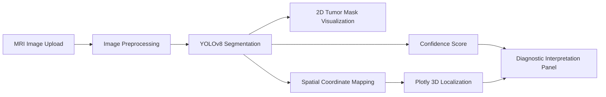

# Brain-AI

<p align="center">
  <strong>MRI-based Brain Tumor Detection, Segmentation, and Visualization System</strong>
</p>

<p align="center">
  
  
  
  
  
</p>

---

## 🧠 Overview

**Brain-AI** is a research-oriented deep learning project for **brain tumor detection, segmentation, and visualization using MRI images**.

The project demonstrates how a medical AI workflow can combine:

- **YOLOv8 segmentation** for 2D tumor detection from MRI slices
- **3D U-Net-based volumetric analysis concept** for 3D medical imaging
- **Streamlit** for an interactive web application
- **Plotly** for anatomical 3D localization and visualization

This project was developed as an academic prototype and is intended for **research and educational demonstration only**.

> This repository is **not a certified medical device** and must not be used as a standalone diagnostic system.

---

## 🖥 Streamlit App Preview

### 1. Brain Tumor 3D Diagnosis and XAI Interface

<p align="center">
  
  <br>
  <em>Figure 1. Streamlit interface showing 2D tumor segmentation and anatomical 3D localization.</em>
</p>

### 2. Precision Diagnostic Interpretation Panel

<p align="center">
  
  <br>
  <em>Figure 2. Diagnostic interpretation panel with confidence score, estimated lesion size, and spatial mapping.</em>
</p>

---

## ✨ Key Features

| Feature | Description |
|---|---|
| MRI Upload | Upload MRI slice images through the Streamlit sidebar |
| Tumor Detection | Detect tumor regions using a YOLOv8 segmentation model |
| 2D Segmentation | Visualize AI-segmented tumor regions on MRI slices |
| 3D Localization | Map detected tumor position into a simplified anatomical 3D space |
| Confidence Analysis | Display model confidence and reliability indicators |
| Diagnostic Summary | Provide interpretation cards for confidence, lesion size, and spatial mapping |
| Technical Parameters | Show inference time, preprocessing method, and model metadata |

---

## 🛠 Tech Stack

| Category | Technology |
|---|---|
| Language | Python |
| Web Framework | Streamlit |
| Deep Learning | PyTorch |
| Detection / Segmentation | Ultralytics YOLOv8 |
| Medical Imaging Workflow | 3D U-Net concept, MONAI-based preprocessing workflow |
| Image Processing | OpenCV, Pillow, NumPy |
| Visualization | Plotly |
| Data Handling | Pandas |
| Dataset Source | Kaggle / BraTS-related brain tumor MRI dataset |

---

## Model Architecture

### YOLOv8 Segmentation

YOLOv8 is used for **2D MRI slice-based tumor detection and segmentation**.

Project configuration summary:

| Item | Setting |
|---|---|
| Model | YOLOv8s-Segmentation |
| Task | Brain tumor segmentation |
| Input | MRI slice image |
| Image size | 240 |
| Batch size | 16 |
| Epochs | 5 |
| Output | Tumor mask, bounding box, confidence score |

### 3D U-Net Concept

The project also includes a 3D medical imaging workflow concept based on **3D U-Net**.

The 3D U-Net workflow focuses on:

- volumetric MRI data handling,
- 3D convolution-based segmentation,
- Dice-loss-based optimization,
- and tumor region analysis across MRI volume space.

### Streamlit Application

The deployed application provides:

- MRI image upload,
- YOLOv8 model inference,
- 2D tumor segmentation visualization,
- Plotly-based 3D tumor localization,
- confidence score display,
- lesion size estimation,
- spatial mapping interpretation,
- and a technical parameter panel.

---

## Dataset

This project uses a **brain tumor MRI dataset from Kaggle / BraTS-related sources**.

Project presentation summary:

| Item | Description |
|---|---|
| Target disease | Adult glioma, including GBM and lower-grade glioma |
| Number of cases | 1,251 cases |
| MRI modalities | 4 MRI modalities per case |
| Segmentation classes | ET, TC, WT |
| 2D slice dataset | 64,213 MRI slice images |
| Preprocessing | 3D NIfTI to 2D image conversion |
| Split | Train / Validation = 8 : 2 |

> Dataset files, MRI images, and segmentation labels are **not owned by this repository author**.  
> They remain subject to the original dataset license and terms of use.

---

## Repository Structure

```bash
Brain-AI/
├── app.py
├── README.md
├── LICENSE
├── requirements.txt
├── packages.txt
├── .gitignore
```

> The trained YOLOv8 weight file (`best.pt`) is **not included in this repository**.  
> If you want to run real inference, you need to train the model separately and place the resulting weight file in the project root.

---

## Installation

### 1. Clone the repository

```bash
git clone https://github.com/jechoi2026-00/Brain-AI.git
cd Brain-AI
```

### 2. Install dependencies

```bash
pip install -r requirements.txt
```

### 3. Prepare model weights

The trained YOLOv8 weight file is not included in this repository.

If you have a trained model, place it in the project root with the following filename:

```bash
best.pt
```

The current Streamlit app expects this path:

```python
model = YOLO("best.pt")
```

If `best.pt` is missing, the app will not be able to perform real tumor segmentation inference. In that case, you can still review the source code and interface structure, but model prediction requires a trained weight file.

### 4. Run the application

```bash
streamlit run app.py
```

---

## Requirements

```txt
streamlit
opencv-python-headless
numpy
torch
ultralytics
Pillow
plotly
pandas
```

For Streamlit Cloud or Linux deployment, `packages.txt` may include:

```txt
libgl1
libglib2.0-0
```

---

## Model Weight Availability

This repository does **not** include a trained `.pt` model file.

The application code is written to load:

```python
YOLO("best.pt")
```

Therefore, real inference requires one of the following:

| Option | Description |
|---|---|
| Train your own model | Run the training notebook and export the final YOLOv8 weight file as `best.pt` |
| Use a private model file | Place your own trained `best.pt` in the project root |
| Use demo-only mode | Keep the repository without weights and use it as a code/UI demonstration project |

The `.pt` file is excluded from Git tracking because model weights can be large and may be affected by dataset or license restrictions.

---

## Project Workflow



---

## Results Summary

The project presentation reported the following evaluation examples:

| Metric | Value |
|---|---:|
| Dice Score | 0.9099 |
| AUC | 0.9585 |

The Streamlit application also displays case-level inference information such as:

- tumor detection confidence,
- estimated lesion area,
- normalized spatial coordinates,
- inference time,
- and preprocessing status.

---

## Limitations

- This project is an academic prototype.
- It is not intended for real clinical diagnosis.
- The model weight file is not included in this repository.
- The model was trained under limited experimental conditions.
- Performance may vary depending on MRI modality, preprocessing, dataset split, and model weights.
- The current 3D localization is a simplified visualization, not a full anatomical registration pipeline.

---

## Future Work

Possible improvements include:

- multimodal MRI fusion using FLAIR, T1CE, T1, and T2,
- improved 3D segmentation using full volumetric models,
- Grad-CAM or attention-based explainability,
- domain-specific medical image augmentation,
- federated learning for multi-institutional training,
- and extension to other neurological diseases.

---

## License

This project is licensed under the **MIT License**.  
See the [LICENSE](LICENSE) file for details.

---

## Copyright Notice

Copyright (c) 2026 Jeongeun Choi

The MIT License applies only to the **original source code and documentation** created by the repository author.

It does **not** apply to external materials, including:

- Kaggle or BraTS-related datasets,
- MRI images and segmentation masks,
- pretrained or externally trained model weights,
- third-party libraries,
- external figures, screenshots, papers, or media.

All external materials remain the property of their respective copyright holders and must be used according to their own licenses and terms.

